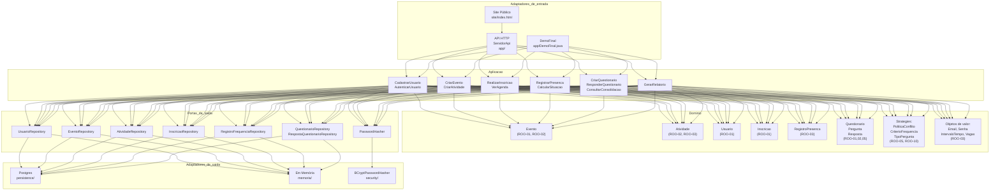
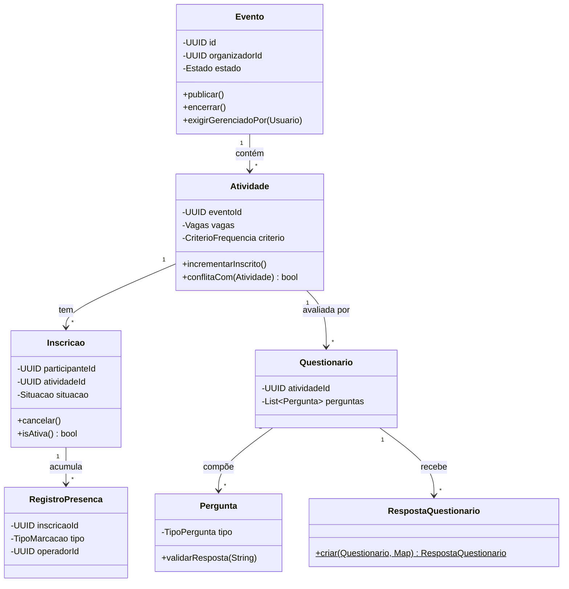

# Modelo de domínio e arquitetura

## Diagrama arquitetural (Ports & Adapters / Hexagonal)

## Mapa de responsabilidades (ROO-01 a ROO-12)

| ROO | Evidência no código |
|---|---|
| ROO-01 Modelo de domínio | `Evento`, `Atividade`, `Inscricao`, `Usuario`, `RegistroPresenca`, `Questionario`, `Pergunta` — cada um com comportamento, não só dados |
| ROO-02 Encapsulamento | `Evento.publicar()`, `Evento.encerrar()`, `Atividade.incrementarInscrito()` — estado muda só pelos métodos; sem setters públicos |
| ROO-03 Objetos de valor | `Email`, `Senha`, `IntervaloTempo`, `Vagas`, `Pergunta`, `Resposta` — imutáveis, validam na construção |
| ROO-04 Composição | `RealizarInscricaoUseCase` composto com `PoliticaConflitoHorario`; `CriterioFrequencia` composto com `ValidadorFrequenciaStrategy` |
| ROO-05 Polimorfismo | `PoliticaConflitoHorario` (2 implementações), `CriterioFrequencia` (3 estratégias embutidas no enum), `TipoPergunta` (3 validações sem if/switch) |
| ROO-06 Herança | Não usada — composição foi sempre a opção mais simples para os pontos de variação existentes |
| ROO-07 Interfaces | `RelatorioExportavel`, `PoliticaConflitoHorario`, todas as portas de saída (`*Repository`, `PasswordHasher`) |
| ROO-08 SOLID | Open/Closed em `RelatorioExportavel` (novo formato = nova classe); Dependency Inversion em todos os casos de uso (dependem de interfaces, não de classes concretas) |
| ROO-09 Arquitetura hexagonal | `domain/` e `application/` não importam nada de `infrastructure/`; adaptadores injetados em `app/ServidorApi.criar()` |
| ROO-10 Padrões | Strategy (`PoliticaConflito`, `CriterioFrequencia`, `TipoPergunta`), Repository, Factory Method (`RespostaQuestionario.criar`) — ver D-07 |
| ROO-11 Erros do domínio | Hierarquia `DominioException` com 9 subclasses com mensagens legíveis; nunca `RuntimeException` genérica para regras de negócio |
| ROO-12 Testes e refatoração | 155 testes (JUnit 5), 4 refatorações documentadas em D-08, testes de mutação executados em S4/S6 para confirmar que os testes têm dentes |

## Diagrama de classes simplificado

